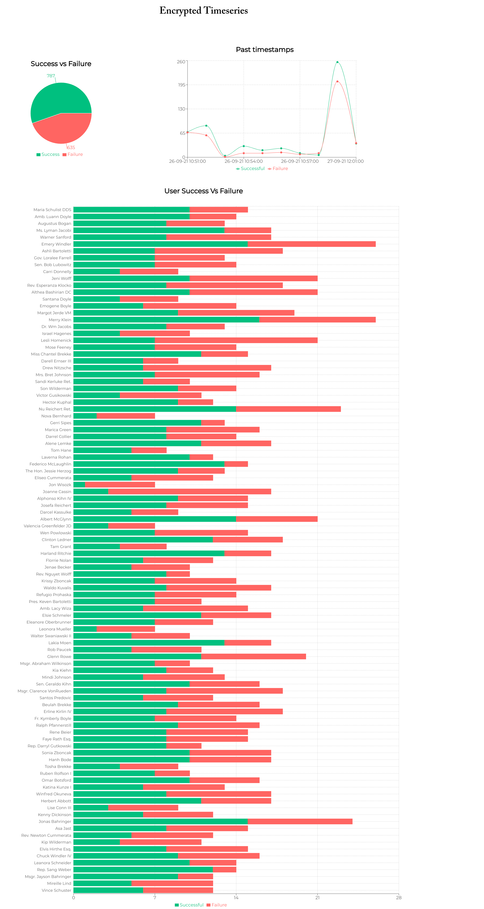

# Encrypted Timeseries

Encrypted Timeseries consists of a collection of small, autonomous services. These services are written Node.js & React.

## Emitter Service

A service which emit an encrypted data stream over a socket. Data stream consists of encrypted messages where the number of encrypted strings can be anywhere between 49-499. Each message is an object with with 3 keys: `name, origin, destination` from a constant list provided in `emitter-service/src/data/data.json` file & a `secret_key` sha-256 hash of the message. The message is encrypted with `aes-256-ctr` alogrithm.

### Example

```
originalMessage = {
  name: 'Jack Reacher',
  origin: 'Bengaluru',
  destination: 'Mumbai'
}

adds a secret_key by creating a sha-256 hash of the above object

sumCheckMessage = {
  name: 'Jack Reacher',
  origin: 'Bengaluru',
  destination: 'Mumbai',
  secret_key: "sha-256 ash of originalMessage",
}

encrypts this payload using encryption algorithm `aes-256-ctr` with a pass key in `.env`

encryptedMessage = "encrypted message string"
```

the data stream is long string of `|` separated encrypted messages and will look like this

"e84742dedd1ddc924e5bfe9a5d912a1918e217f98e5578d04fd5c12426022240|4bbf088f4fc646d7a65b1f84172a59f665a09beb226368ff53d46a5edfd75dc6|3743c3ff07694a3e5540dfc14d57dcfdd6868439f9b5b83162be9162d8032999|26ccd3d082227c49907af7d3e4f19aec764f73d20b73ca4337df818b68cf6975|8d5c45f45be31d657dd58ae4e2c8222f61a779ad11fe36da7b00511ac2b5c01a|e97451a0c72d4202915f6c43b48bc4c0a500851e4c71b66b51b3a588e6522316|99624125591ebecb2c4e34695bf8d1e8a36b73087fd0c8e6c4fad087fa244d5c|b70ed78f5befa9c64ecd9ddcb64f18868ba86debf6b833ce440bcb772be3171c|a9bec91a127fb7b76a462fadeac5090b8dc753841f1fd54ac758f4cdb9af5fc0|2c345c51005cd0b0df92b089dba17e82e321725f539b1cdfceebd6eab69c336a"

The emitter service connects with listener service over sockets and periodically send out a new message stream every 10s

## Listener Service

### Details

A [node.js](https://nodejs.org/en/), [express](https://expressjs.com/) and [socket.io](https://socket.io/) application with following functionality

- Routing
- Socket connection
- Connect to MongoDB with mongoose

Structure of Timeseries Model

```javascript
  {
    name: {
      type: String,
      require: true,
    },
    timestamp: {
      type: Date,
      required: true,
    },
    timeSeriesData: [
      {
        _id: 0,
        timestamp: {
          type: Date,
        },
        origin: {
          type: String,
        },
        destination: {
          type: String,
        },
      },
    ],
    success: {
      type: Number,
      default: 0,
    },
    failed: {
      type: Number,
      default: 0,
    },
  }
```

### Process

A service which connects with emitter over sockets listens for data stream.

- Add connection to `listener-client` room
- Seprate stream of messages `|`.
- Decrypt this messages.
- Check for hash
  - IF hash matches
    - Add a timestamp
    - Increment success count by 1
    - Upsert the `name, timestamp, timeSeriesData` in DB
  - ELSE
    - Increment failure count by 1
    - Upsert the failure count 1
- Send data to `frontend-client` room

## Client

This is a react applciation which connects with listener service over sockets and gets the realtime data.

- [recharts](https://recharts.org/en-US/) is used for displaying graphs.
- [moment](https://momentjs.com) for formatting dates.
- For state management
  - [redux](https://redux.js.org/), [react-redux], [redux-thunk]()

## Running the application

Use the package manager [npm](https://www.npmjs.com/) or [yarn](https://yarnpkg.com/) to install the packages for the project.

Go to the directory where you would like to clone the [repo](https://github.com/KunjManiar/encrypted-timeseries.git).

```sh
$ git clone https://github.com/KunjManiar/encrypted-timeseries.git

# Go to all three directories and

$ npm install or yarn add

```

### Add .env files

#### Emitter service

```
PORT = 3001
EMITTER_URL = http://localhost:3000
PASS_KEY = "RANDOM_STRING"
```

#### Listener Service

```
PORT  = 3000
PASS_KEY = "RANDOM_STRING"
DATABASE_HOST = host
DATABASE_USERNAME = username
DATABASE_PASSWORD = password
DATABASE_NAME = db_name
```

Note: `PASS_KEY` should be same for both the files.

Go to the services in different terminals

#### Listener Service

```sh
npm start
OR # for development
npm run start-dev
```

#### Emitter Service

```sh
npm start
OR # for development
npm run start-dev
```

#### Client

```sh
npm start
OR
yarn start
```

Note: You can install [concurrently](https://www.npmjs.com/package/concurrently) as dev dependency and run them together by adding following in `package.json` script.

### For Example (Listener on Dev)

```
    "emitter": "node src/app.js --prefix emitter-service",
    "listener": "node src/app.js",
    "client": "npm run start --prefix client",
    "dev": "concurrently \"npm run emitter\" \"npm run listener\" \"npm run client\"",

```

## Demo Screenshot


